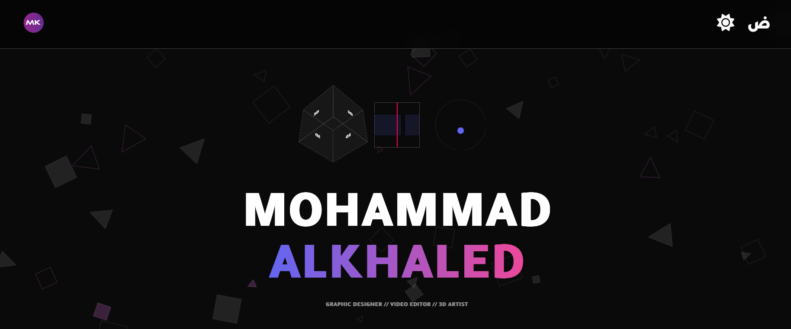

# 🎨 Designer Mohammad Alkhaled Portfolio

A high-performance, SEO-optimized personal portfolio and management dashboard. Built to showcase creative works.

[Live Demo](https://mohammadalkhaled.somee.com)

## 🖼️ Screenshot



## 🚀 Overview

This project is a web application designed to bridge the gap between high-end design aesthetics and modern software architecture. It features a public-facing portfolio and a private **Admin Dashboard** for managing content in real-time.

### Key Highlights:

- **Dual-Nature Architecture:** Seamlessly integrates a client-side portfolio with a secure management dashboard.
- **Performance & SEO:** Leveraging **Vike** for pre-rendering and client hydration to ensure lightning-fast load times and great search engine indexing.
- **Advanced UX:** Implements a **Hybrid Pagination** system, combining server-side efficiency with client-side smoothness.
- **Global Ready:** Full localization support via `i18n-next` for multi-language accessibility.

---

## 🛠 Tech Stack

### Frontend

- **Framework:** React 19+ with [Vike](https://www.google.com/search?q=https://vike.dev/) (Vite-plugin-ssr)
- **Localization:** `i18n-next` (React-i18next)
- **Styling:** Modern CSS (Responsive design)
- **Data Fetching:** Axios

### Backend

- **Runtime:** .NET 10 (LTS)
- **Database:** SQL Server
- **ORM:** Entity Framework Core
- **Authentication:** JWT (JSON Web Tokens)
- **Architecture:** Focus on OOP best practices and Unified API Response patterns.

---

## ✨ Features

- **Secure Admin Dashboard:** A full-featured CMS for the designer to upload, edit, and delete "Works".
- **Work Management System:** Organize projects by categories, tags, and dates.
- **SEO & SSG:** Optimized content delivery through pre-rendering.
- **Hybrid Pagination:** Dynamically switches between client-side filtering and server-side fetching to reduce API overhead.
- **i18n Localization:** Easily switch between languages with persistent user preferences.
- **Unified API:** Standardized JSON response structure for predictable frontend consumption.

---

## 🏁 Getting Started

### Prerequisites

- [.NET 10 SDK](https://www.google.com/search?q=https://dotnet.microsoft.com/download)
- [Node.js (v20+)](https://www.google.com/search?q=https://nodejs.org/)
- SQL Server (LocalDB or Express)

### Installation

1. **Clone the Repository:**

```bash
git clone https://github.com/ali-alzeer/designer-portfolio.git
cd designer-portfolio
```

2. **Setup Backend:**

```bash
cd mk.backend
dotnet ef database update
dotnet run
```

3. **Setup Frontend:**

```bash
cd frontend
npm install
npm run dev
```

---

## 🛡 License

Distributed under the MIT License. See `LICENSE` for more information.
